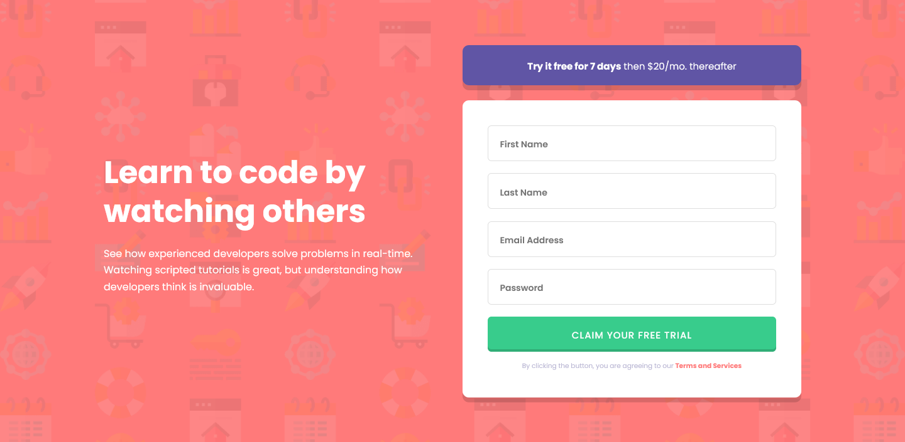

# Frontend Mentor - Intro component with sign up form solution

This is a solution to the [Intro component with sign up form challenge on Frontend Mentor](https://www.frontendmentor.io/challenges/intro-component-with-signup-form-5cf91bd49edda32581d28fd1).

## Table of contents

- [Overview](#overview)
  - [The challenge](#the-challenge)
  - [Screenshot](#screenshot)
- [My process](#my-process)
  - [Built with](#built-with)
  - [What I learned](#what-i-learned)
- [Author](#author)

## Overview

### The challenge

Users should be able to:

- View the optimal layout for the site depending on their device's screen size
- See hover states for all interactive elements on the page
- Receive an error message when the `form` is submitted if:
  - Any `input` field is empty. The message for this error should say _"[Field Name] cannot be empty"_
  - The email address is not formatted correctly (i.e. a correct email address should have this structure: `name@host.tld`). The message for this error should say _"Looks like this is not an email"_

### Screenshot

### Links

- Solution URL: [https://github.com/adamwozhere/fm-sign-up-form](https://github.com/adamwozhere/fm-sign-up-form)
- Live Site URL: [https://adamwozhere.github.io/fm-sign-up-form/](https://adamwozhere.github.io/fm-sign-up-form/)

## My process

### Built with

- React
- TypeScript
- Vite
- Zod (validation library)
- React-hook-form (form library)

### What I learned

In this project I tried to test my skills with learning TypeScript and React. Learning the Zod validation library was very useful as it plays nicely with TypeScript -- I could create a type for the form schema so that it is typechecked with TS while I'm coding. `export type UserSchema = z.infer<typeof User>;` It also allowed me to create further checks for inputs and custom error messages, e.g. the password field requires 8 - 20 characters with at least one lower and one uppercase letter, and one number.

React-hook-form was also great to use as it helped with a lot of built in functions to set focus to inputs on errors etc. and it also has integration with Zod, so I could pass my Zod form schema to it to use handle the validation.

I also tried to implement semantic and accessibility by using a visually hidden class for labels, and error messages with the `role="alert"` attribute.

## Author

- Website - [adamwozniak.uk](https://adamwozniak.uk)
- Frontend Mentor - [@adamwozhere](https://www.frontendmentor.io/profile/adamwozhere)

